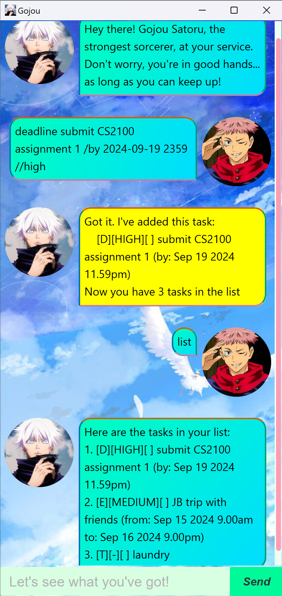

# Gojou User Guide



Gojou is the "strongest" chatbot that helps you manage your tasks efficiently. You can store to-do items, set deadlines, and keep track of events. Gojou also lets you query, list, and delete tasks with simple commands.

## Adding todo tasks

Start with todo, followed by the task you need to do and Gojou will remember the task for you. 

`todo (task)` <br>
Example: `todo laundry`

Expected output:
```
Got it. I've added this task:
    [T][-][] laundry
Now you have 1 tasks in the list
```

## Adding deadlines

Start with deadline, followed by the task you need to do and the deadline. Deadline needs to be in YYYY-MM-DD HHMM format. Gojou will remember the deadline for you.

`deadline (task) /by (deadline)` <br>
Example: `deadline submit assignment /by 2024-09-19 1800`

Expected output:
```
Got it. I've added this task:
    [D][-][] submit assignment (by: Sep 19 2024 6.00pm)
Now you have 2 tasks in the list
```

## Adding events

Start with event, followed by the task you need to do and the start and end dates. Start and end dates need to be in YYYY-MM-DD HHMM format. Gojou will remember the event for you.

`event (description) /from (start) /to (end)` <br>
Example: `event go JB /from 2024-09-19 0900 /to 2024-09-20 2100`

Expected output:
```
Got it. I've added this task:
    [E][-][] go JB (from: Sep 19 2024 9.00am to: Sep 20 2024 9.00pm)
Now you have 3 tasks in the list
```


## Mark a task as done

Start with mark, followed by the task number to mark. Gojou will mark the task as done with an X.

`mark (number)` <br>
Example: `mark 2`

Expected output:
```
Nice! I've marked this task as done:
    [D][-][X] submit assignment (by: Sep 19 2024 6.00pm)
```

## Unmark a task 

Start with unmark, followed by the task number to mark. Gojou will unmark the task.

`unmark (number)` <br>
Example: `unmark 2`

Expected output:
```
OK, I've marked this task as not done yet:
    [D][-][] submit assignment (by: Sep 19 2024 6.00pm)
```

## Show all tasks 

Type list and Gojou will show you all the tasks he remembers.

Example: `list`

Expected output:
```
Here are the tasks in your list:
1. [T][-][] laundry
2. [D][-][] submit assignment (by: Sep 19 2024 6.00pm)
3. [E][-][] go JB (from: Sep 19 2024 9.00am to: Sep 20 2024 9.00pm)
```

## Delete a task

Type delete followed by task number and Gojou will delete the task from his memory.

`delete (number)` <br>
Example: `delete 3`

Expected output:
```
Noted. I've removed this task:
    [E][-][] go JB (from: Sep 19 2024 9.00am to: Sep 20 2024 9.00pm)
Now you have 2 tasks in the list
```

## Search for task

Type find followed by keyword(s) and Gojou will find the task(s) for you.

`find (keyword)` <br>
Example: `find assignment`

Expected output:
```
Here are the matching tasks in your list:
1. [D][-][] submit assignment (by: Sep 19 2024 6.00pm)
```

## Add priority to task

Type //high, //medium or //low to add priority to tasks. Gojou will update his memory to show tasks of higher priority first!

`(todo/deadline/event) (description and dates if applicable) //(priority)` <br>
Example: `deadline submit proposal /by 2024-09-19 1430 //high` 

Expected output:
```
Got it. I've added this task:
    [D][HIGH][] submit proposal (by: Sep 19 2024 2.30pm)
Now you have 3 tasks in the list
```

## Exit chatbot

Type bye and Gojou will bid you farewell

Example: `bye`

Expected output:
```
Alright, time for me to head out. Don't miss me too much, okay? 
After all, the strongest never stays gone for long. See ya!
```